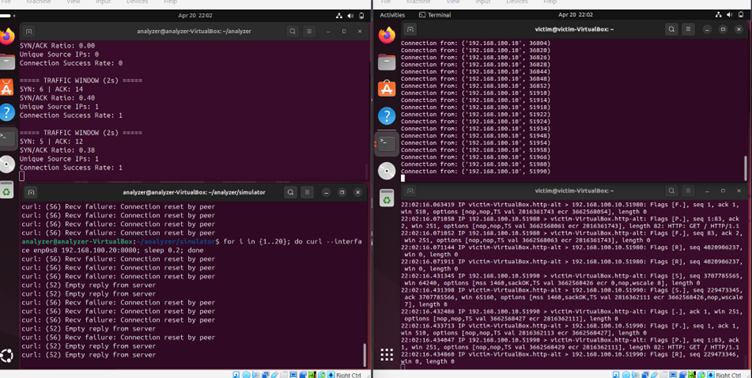
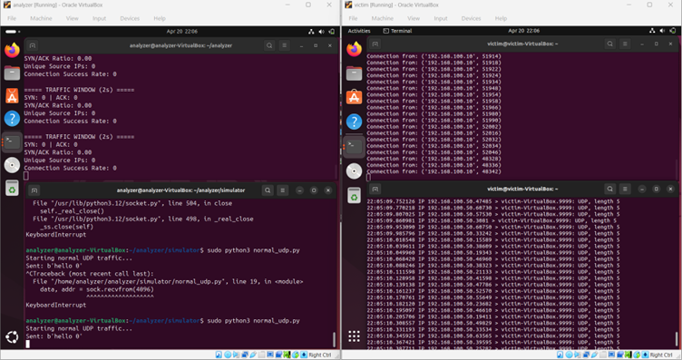
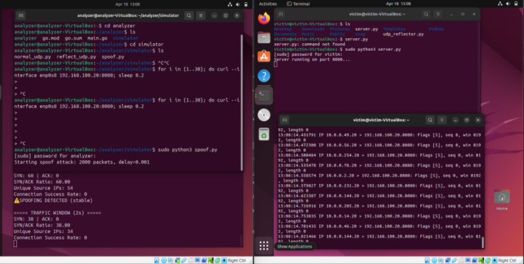
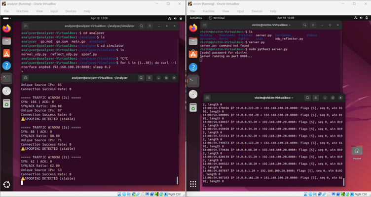
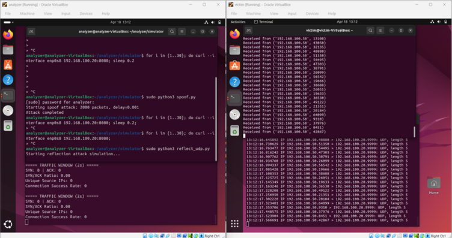

# IP Spoofing Simulation and Detection in a Controlled Virtual Network

**IP Spoofing Simulation and Detection** is an academic project that simulates TCP SYN spoofing and UDP reflection attacks within an isolated virtual network. Built with Python (Scapy) for traffic generation, Go (gopacket) for packet-level analysis, and VirtualBox for network isolation, this project demonstrates how IP spoofing disrupts TCP handshakes and how rule-based detection logic can identify such anomalies.

---

## What This Repository Contains

- **TCP SYN Spoofing Simulator** -- Crafts and sends TCP SYN packets with randomized fake source IP addresses using Scapy
- **UDP Reflection Attack Simulator** -- Sends spoofed UDP packets to a reflector service, simulating amplification-based attacks
- **Victim TCP Server** -- A socket-based server that listens for and logs incoming TCP connection attempts
- **UDP Reflector Service** -- A UDP echo server that reflects incoming packets back to the (spoofed) source address
- **Packet Analyzer** -- A Go-based tool using gopacket that captures live traffic, extracts TCP flags, and computes SYN/ACK ratios for anomaly detection

---

## Key Features

- **TCP SYN Flood Simulation:** Generates 2000 SYN packets with spoofed source IPs from the 10.0.0.0/24 range, targeting port 8080 on the victim server. The spoofed packets produce incomplete TCP handshakes that the analyzer detects.

- **UDP Reflection Attack Simulation:** Sends UDP packets to a reflector with the victim's IP as the source address, causing the reflector to direct its responses toward the victim. This demonstrates amplification-based attack vectors.

- **Packet-Level Analysis:** The Go analyzer captures packets on the network interface in promiscuous mode, parses TCP layer data, and tracks SYN and ACK flag counts in real time with periodic reporting every 50 packets.

- **Rule-Based Detection Logic:** Applies a threshold rule where a SYN/ACK ratio exceeding 3:1 triggers a spoofing alert. This directly exploits the fact that spoofed SYN packets cannot complete the three-way handshake, resulting in disproportionately low ACK counts.

---

## Architecture Overview

```
+------------------------------+
|      Attacker VM             |
|   192.168.100.10             |
|                              |
|  +----------+  +-----------+ |
|  | spoof.py |  |reflect_udp| |
|  +----+-----+  +-----+-----+ |
|       |              |        |
+-------|--------------|--------+
        |              |
   Internal Network (labnet)
        |              |
+-------|--------------|--------+
|       v              v        |
|  +----------+  +-----------+  |
|  | server.py|  |udp_reflect|  |
|  +----------+  +-----------+  |
|                               |
|      Victim VM                |
|   192.168.100.20              |
+-------------------------------+
        |
        | (passive capture)
        v
+-------------------+
|   analyzer.go     |
| (runs on Attacker |
|  VM, captures     |
|  interface traffic)|
+-------------------+
```

**Data Flow:**
- The attacker sends packets (TCP SYN or UDP) to the victim across the internal network
- The victim server processes or attempts to respond to incoming connections
- The analyzer passively captures all packets on the shared interface and evaluates TCP flag distributions

---

## How It Works

1. **Environment Initialization** -- Two Ubuntu virtual machines are created in VirtualBox, connected via an internal network named `labnet`. Static IPs are assigned: 192.168.100.10 (attacker) and 192.168.100.20 (victim). No internet access is configured.

2. **Victim Server Startup** -- The TCP server (`server.py`) binds to port 8080 and begins accepting connections. For UDP experiments, the reflector (`udp_reflector.py`) binds to port 9999.

3. **Analyzer Activation** -- The Go analyzer opens the network interface in promiscuous mode and begins capturing all TCP packets, initializing SYN and ACK counters.

4. **Normal Traffic Baseline** -- Legitimate TCP connections are generated using `curl` commands from the attacker VM. The analyzer observes balanced SYN and ACK counts, confirming a healthy handshake pattern.

5. **Spoofed Traffic Injection** -- The `spoof.py` script sends 2000 TCP SYN packets with randomized source IPs. Since these IPs are fake, the victim's SYN-ACK responses are sent to nonexistent hosts, and no ACK is ever returned.

6. **Detection Evaluation** -- The analyzer detects a sharp divergence between SYN and ACK counts. When the SYN/ACK ratio exceeds the threshold of 3:1, it flags the traffic as suspicious and reports a spoofing detection alert.

7. **UDP Reflection Test** -- The `reflect_udp.py` script sends UDP packets to the reflector with the victim's IP as the source. The reflector echoes data back to the victim, demonstrating how reflection attacks amplify traffic toward a target.

---

## Technologies Used

| Tool / Technology | Purpose |
|---|---|
| Python 3 | Traffic generation scripts (attacker and victim sides) |
| Scapy | Packet crafting and IP spoofing simulation |
| Go | Packet analyzer implementation |
| gopacket | Packet capture and TCP flag parsing |
| tcpdump | Manual packet verification and debugging |
| VirtualBox | Virtual machine management and network isolation |
| Ubuntu | Operating system for both virtual machines |
| Netplan | Static IP configuration on Ubuntu |

---

## Repository Structure

```
IP_Spoofing/
├── README.md                    # Main project documentation
├── docs/
│   ├── ARCHITECTURE.md          # System design and data flow
│   ├── SETUP_GUIDE.md           # Environment and network configuration
│   ├── EXECUTION_GUIDE.md       # Step-by-step execution instructions
│   ├── EXPERIMENT_RESULTS.md    # Experimental findings and comparisons
│   ├── DETECTION_LOGIC.md       # Detection rules and analysis
│   ├── TROUBLESHOOTING.md       # Common issues and resolutions
│   └── CODE_EXPLANATION.md      # Detailed explanation of each source file
├── simulator/
│   ├── spoof.py                 # TCP SYN spoofing script (Scapy)
│   └── reflect_udp.py           # UDP reflection attack script (Scapy)
├── analyzer/
│   └── analyzer.go              # Packet capture and analysis tool (Go)
├── victim/
│   ├── server.py                # TCP victim server (Python socket)
│   └── udp_reflector.py         # UDP echo/reflector service
├── scripts/                     # Utility scripts (network setup, testing)
└── screenshots/
    ├── normal_tcp.png           # Normal TCP traffic capture
    ├── normal_udp.png           # Normal UDP traffic capture
    ├── SYN_Flooding_1.png       # SYN flood attack -- analyzer output
    ├── SYN_Flooding_2.png       # SYN flood attack -- continued detection
    ├── Reflecting_Attack_1.png  # UDP reflection attack -- initial phase
    └── Reflecting_Attack_2.png  # UDP reflection attack -- sustained traffic
```

---

## Setup and Execution

### Environment Setup

1. Install VirtualBox on the host machine.
2. Create two Ubuntu virtual machines:
   - **VM1 (Attacker + Analyzer):** 2048 MB RAM, 2 CPU cores, 20 GB disk
   - **VM2 (Victim):** 1536 MB RAM, 1 CPU core, 20 GB disk
3. Set the network adapter for both VMs to **Internal Network** with the name `labnet`. Enable **Promiscuous Mode: Allow All**.
4. Inside each VM, install dependencies:

```bash
sudo apt update && sudo apt upgrade -y
sudo apt install python3-pip tcpdump golang -y
pip3 install scapy
```

5. Configure static IPs using Netplan (`/etc/netplan/01-netcfg.yaml`):

**Attacker VM:**
```yaml
network:
  version: 2
  ethernets:
    enp0s3:
      dhcp4: no
      addresses: [192.168.100.10/24]
```

**Victim VM:**
```yaml
network:
  version: 2
  ethernets:
    enp0s3:
      dhcp4: no
      addresses: [192.168.100.20/24]
```

```bash
sudo netplan apply
```

### Running the Project

**Step 1:** Start the victim server on VM2:
```bash
sudo python3 victim/server.py
```

**Step 2:** Build and start the analyzer on VM1:
```bash
cd analyzer
go mod init analyzer
go get github.com/google/gopacket
go build
sudo ./analyzer
```

**Step 3:** Generate normal traffic from VM1:
```bash
for i in $(seq 1 30); do curl --interface enp0s3 192.168.100.20:8080; sleep 0.2; done
```

**Step 4:** Run the SYN spoofing attack from VM1:
```bash
sudo python3 simulator/spoof.py
```

**Step 5:** (Optional) Run UDP reflection attack from VM1:
```bash
sudo python3 simulator/reflect_udp.py
```

### Verification

```bash
sudo tcpdump -i enp0s3 tcp
```

Confirm that:
- Normal traffic shows balanced SYN/ACK pairs
- Spoofed traffic shows SYN packets from random source IPs with no corresponding ACKs
- The analyzer reports increasing SYN/ACK ratio values

---

## Experimental Results

### Normal TCP Traffic

- TCP connections complete the full three-way handshake (SYN, SYN-ACK, ACK)
- The analyzer reports SYN and ACK counts that remain closely balanced
- SYN/ACK ratio stays near 1.0
- Connection success rate is consistently recorded as 1

### Normal UDP Traffic

- UDP packets are transmitted between the attacker and victim without connection state
- The analyzer's TCP-specific counters remain at zero, as expected for UDP-only traffic
- The victim's UDP reflector processes and echoes data without anomalies

### SYN Spoofing Attack

- 2000 SYN packets are sent with source IPs randomized from the 10.0.0.0/24 range
- The victim responds with SYN-ACK to each spoofed IP, but no ACK is returned
- The analyzer detects SYN/ACK ratios of 60:0, 38:0, and higher, with 0 connection success
- Unique source IP counts reach 54, 87, and 85 across successive traffic windows
- The analyzer flags the traffic with a "SPOOFING DETECTED (stable)" alert

### UDP Reflection Attack

- UDP packets are sent to the reflector (port 9999) with the victim's IP spoofed as the source
- The reflector sends responses to the victim, generating unsolicited inbound traffic
- The analyzer's SYN and ACK counters remain at 0 (since the attack is UDP-based), but the victim receives a sustained stream of unrequested packets
- tcpdump on the victim confirms continuous incoming UDP traffic from the reflector's IP

---

## Screenshots

### Normal Traffic

| Scenario | Screenshot | Description |
|---|---|---|
| Normal TCP Flow |  | The analyzer shows balanced SYN/ACK ratios (SYN/ACK Ratio: 0.40-0.38) with connection success rate of 1. The victim terminal displays valid TCP connections being accepted. curl commands complete with responses, confirming full three-way handshakes. |
| Normal UDP Flow |  | The simulator sends normal UDP traffic to the victim. The analyzer's TCP counters remain at 0 (SYN/ACK Ratio: 0.00) as expected. The victim-side tcpdump shows UDP packets being exchanged on port 9999 between the two VMs. |

### Spoofing Attack

| Scenario | Screenshot | Description |
|---|---|---|
| SYN Flood -- Initial Detection |  | The analyzer reports SYN: 60, ACK: 0 with a SYN/ACK ratio of 60.00 and 54 unique source IPs. Connection success rate is 0. The "SPOOFING DETECTED (stable)" alert is triggered. The victim-side tcpdump shows a rapid stream of SYN packets from randomized 10.0.0.x addresses. |
| SYN Flood -- Sustained Attack |  | Continued spoofing shows successive traffic windows with SYN/ACK ratios of 104.00, 88.00, and 62.00. Unique source IPs range from 53 to 87. The spoofing detection flag persists across all windows. The victim continues receiving SYN packets from fabricated addresses with no handshake completion. |

### Reflection Attack

| Scenario | Screenshot | Description |
|---|---|---|
| UDP Reflection -- Launch Phase |  | The attacker runs the spoof attack followed by the reflect_udp.py script. The analyzer shows SYN: 0, ACK: 0 with SYN/ACK Ratio: 0.00 during the UDP reflection phase, since the attack uses UDP rather than TCP. The victim-side tcpdump displays a continuous stream of UDP packets arriving on port 9999 from the spoofed source. |
| UDP Reflection -- Sustained Flood |  | The reflection attack continues generating sustained UDP traffic toward the victim. The analyzer's TCP counters remain at zero throughout. The victim terminal shows an unbroken sequence of incoming UDP packets, demonstrating the amplification effect where the reflector directs all responses to the victim's IP address. |

---

## Limitations

- **Rule-based detection only** -- The threshold-based approach (SYN/ACK ratio > 3) is a heuristic. Sophisticated attackers who inject partial ACKs could evade detection.
- **No return path for spoofed packets** -- The isolated internal network has no routing infrastructure. Spoofed packets with external source IPs (10.0.0.x) have no valid return path, which simplifies detection but does not reflect real-world routing complexity.
- **Single-interface capture** -- The analyzer monitors only one network interface. In multi-segment networks, traffic may traverse interfaces not being monitored.
- **No stateful connection tracking** -- The analyzer counts aggregate SYN and ACK flags without tracking individual connection states or timeouts.
- **UDP detection gap** -- The current analyzer only tracks TCP flags. UDP-based attacks (reflection) are not detected by the analyzer's logic; they are only observable via tcpdump.

---

## Future Scope

- Implement per-source-IP connection state tracking to detect targeted spoofing against specific hosts
- Add statistical anomaly detection (e.g., sliding window variance analysis) alongside the threshold rule
- Extend the analyzer to parse the UDP packets and detect reflection patterns via source/destination IP frequency analysis
- Integrate real-time visualization using Grafana with InfluxDB for continuous traffic monitoring
- Implement automated alerting (email or webhook) when spoofing thresholds are breached
- Add support for PCAP file analysis to enable offline forensic investigation of captured traffic

---

## License

This project is developed for academic purposes. No formal license is applied.

---

## Contact

For questions, issues, or contributions, use [GitHub Issues](../../issues) or reach out via email to the repository maintainer.
